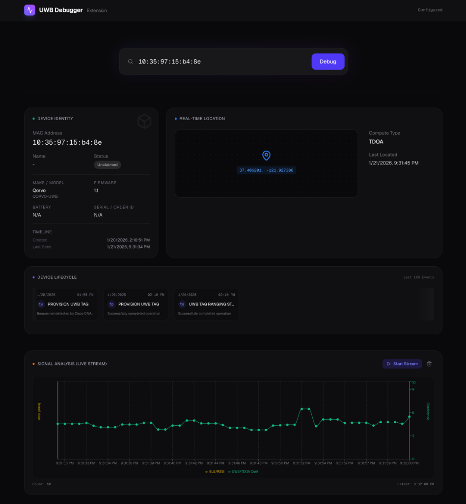

# UWB Device Dashboard & Debugger



A professional debugging extension and dashboard for Ultra-Wideband (UWB) devices in the Cisco Spaces ecosystem. This tool provides real-time signal analysis, device lifecycle tracking, location visualization, and comprehensive usage analytics for Qorvo and other UWB tags.

## 🚀 Features

### Core Functionality
-   **Real-time Signal Analysis**: Visualizes RSSI (BLE) and TDOA Confidence (UWB) streams directly from the Firehose API.
-   **Smart Device Search**: Automatically fetches your claimed devices (filtered for UWB models like `QORVO-UWB`, `SPACES-CT-UB`) and offers autocomplete search.
-   **Device Lifecycle Timeline**: Tracks device events (Provisioning, Ranging, etc.) in a chronological timeline.
-   **Live Location Map**: Visualizes the real-time calculated coordinates (latency < 1s).
-   **Secure Configuration**: Client-side storage of tokens with optional API Key usage.

### 📊 Analytics & Audit
-   **Usage Analytics Dashboard**: A dedicated view (`/analytics`) tracking key performance indicators (KPIs) like total unique users, sessions, and debug events.
-   **Audit Trail**: detailed logs of all user actions (Session Start, Debug Device, Start Stream) with downloadable reports in JSON format.
-   **Live Stream Logs**: Real-time event logging within the Signal Analysis widget, allowing you to inspect and download raw stream data as it arrives.

### ⚡ Performance & Reliability
-   **Cluster Mode**: configured to run in PM2 Cluster Mode, utilizing all available CPU cores for maximum concurrency.
-   **Auto-Startup**: Automatically restarts on server reboot for high availability.
-   **Local Storage**: Uses a high-performance, server-side SQLite database (`analytics.db`) with WAL mode for data persistence.

## 🛠️ Prerequisites

-   **Node.js** 18+ installed.
-   **Cisco Spaces Account** with proper permissions.
-   **Sys Token** (from Cisco Spaces Cookie).
-   **Firehose API Key** (optional, for Signal Graph).

## 📦 Installation

1.  **Clone the repository:**
    ```bash
    git clone https://github.com/santpati/uwb-device-360.git
    cd uwb-device-360
    ```

2.  **Install dependencies:**
    ```bash
    npm install
    # Install PM2 globally if running in production
    sudo npm install -g pm2
    ```

3.  **Run the development server:**
    ```bash
    npm run dev
    ```

4.  Open [http://localhost:3000](http://localhost:3000) in your browser.

## ⚙️ Configuration

Click the **"No Token" / "Configured"** button in the top right corner to open the settings:

1.  **Sys Token** (Required):
    *   **Interactive Guide**: The application includes a built-in visual guide. Hover over the info icon in the configuration modal for step-by-step instructions.
    *   **Manual Steps**:
        1.  Go to [dnaspaces.io](https://dnaspaces.io) and login to your tenant.
        2.  Open Developer Tools (`F12`) -> **Application** tab.
        3.  Expand **Cookies** -> `https://dnaspaces.io`.
        4.  Find `sys-token` and copy the value.
2.  **Tenant ID** (Auto-detected):
    *   Automatically extracted from your Sys Token.
3.  **Firehose API Key** (Optional):
    *   Required only if you want to see the live Signal Analysis chart.

## 🚀 Deployment (Production)

This project is optimized for deployment on AWS EC2 or similar VPS environments.

1.  **Build the application:**
    ```bash
    npm run build
    ```

2.  **Start with PM2 (Cluster Mode):**
    ```bash
    # Uses ecosystem.config.js to launch in cluster mode
    pm2 start ecosystem.config.js
    ```

3.  **Configure Auto-Startup:**
    ```bash
    pm2 startup
    pm2 save
    ```

## 🏗️ Tech Stack

-   **Framework**: [Next.js 15](https://nextjs.org/) (App Router)
-   **Database**: SQLite (`better-sqlite3`)
-   **Process Manager**: PM2
-   **Styling**: [Tailwind CSS](https://tailwindcss.com/)
-   **Icons**: [Lucide React](https://lucide.dev/)
-   **Charts**: [Recharts](https://recharts.org/)

## 🤝 Contributing

Contributions are welcome! Please feel free to submit a Pull Request.

## 📄 License

This project is licensed under the MIT License.
